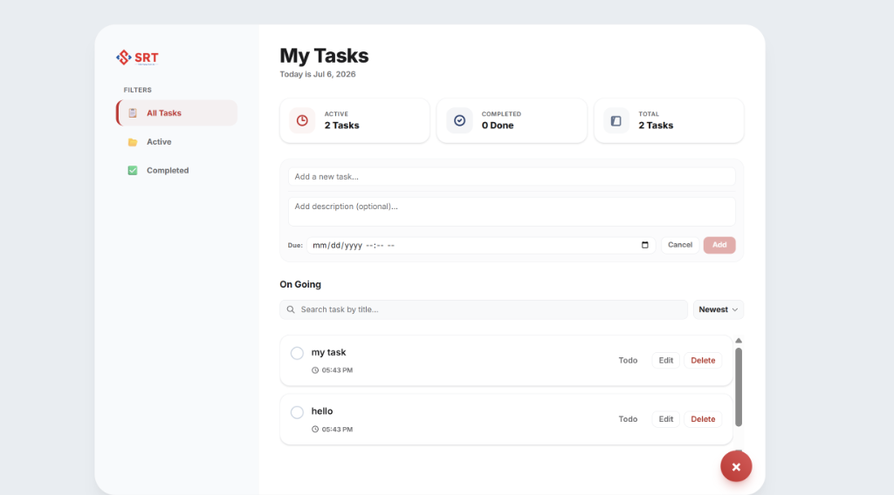
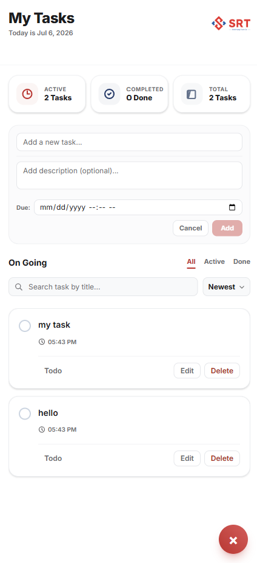

# Todo List Manager

An Intern Developer Technical Test project implementing a full-stack Todo List application. The project is designed with a separate React/Next.js frontend and a Node.js/Express backend, connected to a PostgreSQL database via Prisma ORM.

---

## 🏗️ Architecture

The application is structured as a monorepo consisting of two primary directories:

- **[frontend/](./frontend)**: A React-based web application built with Next.js (App Router), styled using Tailwind CSS. Responsible for rendering the user interface, managing optimistic client states, and interacting with the backend API.
- **[backend/](./backend)**: A RESTful API built with Express, TypeScript, and Node.js. Handles business logic, query parameter transformation, schema validation via Zod, and database queries using Prisma ORM.

---

## ✨ Features

- [x] **View Tasks**: Display a list of tasks with titles, descriptions, creation times, and due dates.
- [x] **Create Task**: Add new tasks with title, description, and optional due date.
- [x] **Update Task**: Inline editing of task title, description, and due date.
- [x] **Delete Task**: Delete tasks with an interactive confirmation pop-up.
- [x] **Complete/Uncomplete Task**: Mark tasks as complete or incomplete with immediate responsive feedback.
- [x] **Search Tasks**: Search for tasks by title with debounced API requests.
- [x] **Filter by Status**: Filter tasks by "All", "Active" (TODO), or "Completed" (DONE).
- [x] **Sorting**: Sort tasks by Newest, Oldest, Title (A-Z), and Title (Z-A).
- [x] **Pagination**: Server-side paginated list with page selectors.
- [x] **Responsive Layout**: Tailored for both desktop monitors and mobile devices.
- [x] **Optimistic Updates**: Immediate UI state feedback on task updates/deletes to eliminate latency feel.

---

## 🛠️ Tech Stack

| Layer                | Technology                                            |
| :------------------- | :---------------------------------------------------- |
| **Frontend**         | React, Next.js (App Router), TypeScript, Tailwind CSS |
| **Backend**          | Node.js, Express, TypeScript, Zod (Validation), CORS  |
| **Database**         | PostgreSQL, Prisma ORM                                |
| **Testing**          | Jest, ts-jest (Backend Unit Tests)                    |
| **Containerization** | Docker, Docker Compose                                |

---

## 📂 Project Structure

```text
todo-manager/
├── backend/
│   ├── prisma/             # Prisma schema & SQL migrations
│   ├── src/
│   │   ├── controllers/    # API request handlers & Zod validation
│   │   ├── lib/            # Shared libraries (Prisma client singleton)
│   │   ├── middlewares/    # Custom Express middlewares (error handling)
│   │   ├── routes/         # Express route mappings
│   │   ├── services/       # Core business logic & database queries
│   │   └── index.ts        # Server entry point
│   ├── Dockerfile          # Multi-stage production container config
│   └── package.json
├── frontend/
│   ├── app/                # Next.js App Router (pages & styles)
│   ├── components/         # Reusable React UI components
│   ├── lib/                # API wrappers & network layers
│   ├── types/              # TypeScript typings
│   ├── Dockerfile          # Frontend container config
│   └── package.json
└── docker-compose.yml      # Orchestration config for db, API, and frontend
```

---

## 🚀 Quick Start

Ensure you have [Docker](https://www.docker.com/) and [Docker Compose](https://docs.docker.com/compose/) installed on your machine.

1. **Clone the repository**:

   ```bash
   git clone https://github.com/HungEzz/todo-manager.git
   cd todo-manager
   ```

2. **Run with Docker Compose**:
   To start the database, backend API, and frontend client concurrently:

   ```bash
   docker compose up --build
   ```

   This command will:
   - Start a PostgreSQL database instance.
   - Run the database migrations automatically.
   - Launch the backend Express server on [http://localhost:3001](http://localhost:3001).
   - Launch the Next.js frontend application on [http://localhost:3000](http://localhost:3000).

3. **Alternative: Local Setup (Without Docker)**:
   If you prefer running the application directly on your host machine:

   **Prerequisites:**
   - [Node.js](https://nodejs.org/) (v20+ recommended)
   - [PostgreSQL](https://www.postgresql.org/) database running locally

   **Step A: Configure Environment Variables**
   - In **[backend/](./backend)**, copy the env example template and update it with your local PostgreSQL credentials:
     ```bash
     cd backend
     cp .env.example .env
     ```
     _Edit the `.env` file:_
     ```env
     DATABASE_URL="postgresql://<username>:<password>@localhost:5432/<database_name>?schema=public"
     PORT=3001
     ```
   - In **[frontend/](./frontend)**, copy the env example template to point to the backend API:
     ```bash
     cd ../frontend
     cp .env.local.example .env.local
     ```
     _Edit the `.env.local` file:_
     ```env
     NEXT_PUBLIC_API_URL=http://localhost:3001/api
     ```

   **Step B: Start Backend API**

   ```bash
   cd ../backend
   npm install
   npx prisma migrate dev       # Applies migrations & creates GIN search indexes
   npm run dev                  # Launches development server on port 3001
   ```

   **Step C: Start Frontend Client**

   ```bash
   cd ../frontend
   npm install
   npm run dev                  # Launches Next.js dev server on port 3000
   ```

For detailed local development instructions, see the sub-project guides:

- [Frontend Development Guide](./frontend/README.md)
- [Backend Development Guide](./backend/README.md)

---

## 📸 Screenshots

### Desktop View



### Mobile View



---

## 🌐 Deployment & Keep-Alive (Render & Vercel)

The application is configured to be deployed as follows:

- **Frontend**: Hosted on [Vercel](https://vercel.com)
- **Backend API**: Hosted on [Render](https://render.com) (Free Web Service)
- **Database**: Hosted on [Supabase](https://supabase.com) (PostgreSQL)

### ☕ Dealing with Render's Cold Start (Free Tier):

Render's free-tier hosting automatically spins down (goes to sleep) after 15 minutes of inactivity. When a user visits the application for the first time, it can take up to 50 seconds for the backend to wake up, causing the loading animation to hang.

To solve this and guarantee a premium review experience:

1. **Frontend Warning Banner**: If the API server takes more than 4 seconds to respond, the frontend application will automatically display an informative warning banner informing the reviewer that the backend server is waking up.
2. **Keep-Alive Cron Job**: Set up a free pinging service (e.g., [Cron-Job.org](https://cron-job.org/) or [UptimeRobot](https://uptimerobot.com/)) to query the backend health check endpoint (`https://<your-render-url>/health`) every **14 minutes**. This prevents the server from sleeping, keeping it awake 24/7.

---

## 🔮 Future Improvements

- **Authentication & Authorization**: Implement JWT-based user login and registration to secure user-specific todo lists.
- **Dark Mode**: Add dark mode toggle utilizing Tailwind CSS.
- **CI/CD Pipeline**: Build a GitHub Actions workflow to run automated tests and build check on pull requests.
- **Online Deployment**: Deploy the frontend on Vercel and the backend/database on platforms like Render or AWS ECS.

---

- **Name**: Pham Nhat Hung
- **GitHub**: [HungEzz](https://github.com/HungEzz)

---

## 📄 License

This project is licensed under the MIT License - see the LICENSE file for details.
